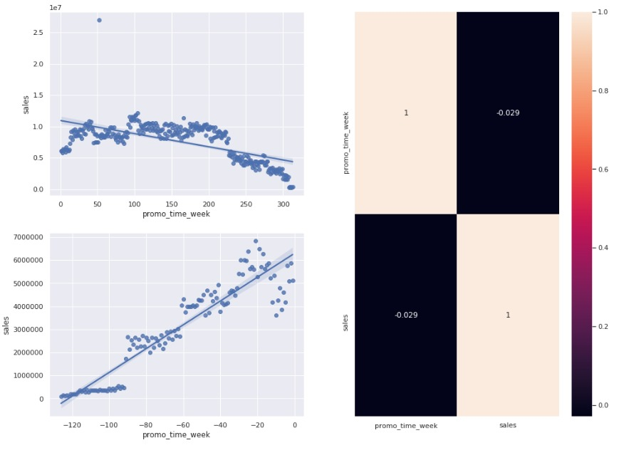

# Rossmann Store Sales

### Rossmann Store Sales is a complete end-to-end Data Science solution on sales forecasting.

We developed an API that is called by a telegram bot, where the Rossmann Store CEO can access on his cellphone and have the sales prediction of each store by hand, enhancing speed in business decision making about the store renovation options. 

## Table of Contents

- [Project Overview](#Overview)
- [Business Problem and Dataset](#Business-Problem)
- [Data Description](#Data-Description)
- [Feature Engineering](#Feature-Engineering) 
- [Exploratory Data Analysis](#Exploratory-Data-Analysis)
- [Machine Learning Modeling](#Machine-Learning_modeling)
- Model Deployment
- Making requests (Telegram Bot) 

## Overview

A quick look at the top-level files and directories you'll see in rossmann-store-sales.

    .
    ├── data
    ├── notebooks
    ├── .gitignore
    ├── README.md
    ├── deployment
    ├── .vscode
    ├── img
    ├── model
    ├── requirements.txt
    ├── parameter
   

1.  **`/data`**: This directory contains all of the unprocessed dataset

2.  **`/notebooks`**: This directory will contain all of the code related to analysis, EDA, modeling, and so on.

3.  **`.gitignore`**: This file tells git which files it should not track / not maintain a version history for.

4.  **`README.md`**: A text file containing useful reference information about your project

5.  **`deployment`**: This folder contains productionized code ready for deployment.

6.  **`.vscode`**: configuration of enviroments used within vscode editor.

7.  **`img`**: folder containing the images from analysis and other images

8.  **`model`**: This folder contain the model serialized by pickle

9. **`requirements`** List of packages used in the project for reproducibility.

10. **`parameter`** This folder contain the parameters serialized by pickle.

## Business Problem 

Rossmann is a private, German drug store chain founded in 1972 and is a key player in the European pharmacy market, with operations in healthcare and beauty retail industries. According to [Bloomberg](https://www.bloomberg.com/profile/company/122549Z:GR), Rossmann offers a wide range of products including baby and body care, hygiene, sun protection, cosmetics, dental hygiene, household, pets, hair care, perfume, fragrances, and food products. 

 Aside from the +2,000 on-site Germany stores (see stores location [here](https://www.rossmann.de/de/filialen/index.html)), Rossmann operations extend to Poland, Czech Republic, Turkey, Albania, and Hungary, totaling +4,100 on-site stores. 
 
 Rossmann is also active on e-commerce for Germany-based customers, with around [$30 million EUR in online revenues per year](https://www.world-today-news.com/the-giant-of-cosmetics-and-drugstore-rossmann-fixed-in-valencia-the-venue-for-its-deployment-in-spain/), making up for 15.2% of market share in Germany. Rossmann's 2018 annual revenue was approximately \$9 billion EUR ([Dun & Bradstreet](https://www.dnb.com/business-directory/company-profiles.dirk_rossmann_gmbh.7342471a5e75a2072c060665843eeecd.html#financials-anchor)). Further financial information is not publicly available. 

In this project, a machine learning model was trained to predict sales revenues for Rossmann. The following setup was utilized:

- Project Methodology: the CRISP-DM was used as the main project management methodology. Two cycles were completed within the total project implementation length of 2-months; a log of each CRISP-DM cycle can be accessed [here](#cycle-description).
- Business Problem and Solution: a fictitious business problem was created to motivate the project. Due to an upper-management request, a 6-week sales prediction project for each Rossmann store will be delivered to the business. Predictions will be available through a Telegram Bot where stakeholders can retrieve information on their smartphones. A machine learning solution was feasible once the CEO of Rossmann wanted the predictions to evaluate if he could use revenue to renovate stores. 

## Data Description

- Data Collection: Data was acquired from [Rossmann's Store Sales Kaggle competition](https://www.kaggle.com/c/rossmann-store-sales/data):

  - **Data Dimensions (rows x columns):** 
    * Train dataset: 969264 x 18 
    * Valid dataset: 47945  x 18
    * Date Range: 2013-01-01 (first) / 2015-07-31 (last)
  
    In this project, we split the whole data into training and validation parts:
    * **Training data** corresponds to all data entries between **2013-01-01 to 2015-06-19**
    * **Validation data** contains entries from the last 6 weeks of available data, **2015-06-19 to 2015-07-31**. 
    * **Test data** corresponds to data entries between **2015-07-31 to 2015-09-16**. This data doesn't have the target variable `sales` and will be used as the input to generate predictions in production

## Feature Engineering

A little feature engineering was done in the beginning to deal with time variables

- Extract year, month, day, week of year, and year week of the data provided
- Create new variable called "competition since" which is the time since the competition started
- Created new variable called "promo_since" which is the time since last promo started

## Exploratory Data Analysis

### Response Variable disstribution

### Categorical Variables 

### Hypotesys
We generated hypotesis to confirm or reject during Exploratory Data Analysis

#### H1: Stores with larger assortments should sell more
False, these stores sell more

#### H2: Stores with closer competitors should sell less.
False, there stores sell more

#### H3: Stores with longer competitors should sell more.
False, these stores sell less

#### H4: Stores with active promotions for longer should sell more.
False, these stores sell less after a period of promotion

#### H5: stores with more consecutive promotions should sell more.
False, these stores sell less

#### H6: Stores open during the Christmas holiday should sell more.
False, these stores sell less

#### H7: Stores should sell more over the years.
False, stores are selling less across the years

#### H8: Stores should sell more on the second semester of the year.
That's False, stores sell less during the second semester of the year

#### H9: Stores should sell more after the 10th of each month.
False, Stores sell roughly the same

#### H10: Stores should sell less on weekends.
True, stores sell less on weekends

#### H11: Stores should sell less during School Holidays.
True, stores sell less 

### Bivariate Analysis

#### Categorical

#### Numerical

## Machine Learning Modeling

**We mainly trained five models, the performance can be seen in the table below**

**We performed cross-validation with five folds to adress the model real performance**

**The chosen model was XGBoostRegressor, the error plot is as follows:**

### Machine Learning Performance

### Business Performance of all stores

## Model Deployment

**The model was deployed within Heroku platform, production code was a handler that creats the API, a tester that calls the API and a class named Rossmann.py, with all the models and parameters serealized by pickle**

### Demo of tester.py making requests of API

